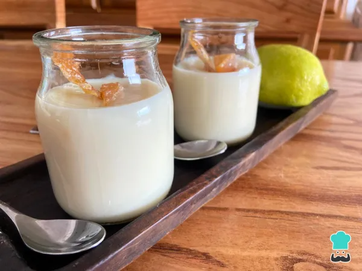

<!--Titulo e imagen de portada-->
# **Postre De Maicena**


<!--Propietario del documento-->
<div style="text-align: center; font-size: 10px">
Marcos Lopez Medina
</div>


<!-- Indice del documento -->
## Indice
1. [Postre de Maicena](#que-es-el-postre-de-maicena)
2. [Ingredientes](#ingredientes)
3. [Preparado](#preparado)
    - 1 Calentar olla 
    - 2 Diluir maicena
    - 3 Vertir mezcla
    - 4 Bajar el fuego y Cocinar sin dejar de remover
    - 5 Apagar fuego y Continuar mezclando
    - 6 Servir distribuyendo
    - 7 ¡A COMER!
4. [Toppings](#toppings-para-acompañar-el-poste-de-maicena)
5. [Valor Nutricional](#valor-nutricional)


<!--Primer apartado  -->
### Que es el postre de Maicena?
<!-- Texto justificado (hecho con html ya que en Markdown no se como hacerlo :D ) -->
<div style="text-align: justify;;">
Este **postre de maicena** es una verdadera delicia: económico, fácil y rápido de preparar, se trata de una crema suave y con un sabor familiar que tanto encanta a los niños como a los adultos. Además, si quieres proporcionar un toque más sofisticado, basta con añadir algún ingrediente extra. Al ser sin *TACC*, es perfecto para personas intolerantes al *gluten*.
<!-- Salto de linea -->
<br>En **RecetasGratis** te enseñamos cómo hacer postre de maicena. ¡Vamos a cocinar!
</div>


<!-- Segundo apartado -->
---
## Ingredientes
<!-- Tabla de ingredientes -->
| Cantidad    | Ingrediente                |
|:-----------:|----------------------------|
| 2 Tazas     | Leche (480 mililitros)     |
| 2 Cdas      | Azúcar                     |
| 2 Cdas      | Maicena                    |
| 1 Cdta      | Esencia de vainilla        |
| Medio Limon | Piel                       |
---
<!-- Tercer Apartado -->
## Preparado
<!--Preparado paso a paso de la receta -->
*1. Calienta en una olla **una taza de leche** junto con el azúcar, la esencia de vainilla y la piel de limón.*

---

*2.Mientras se calienta, **no debe llegar a hervir**, diluye la maicena en la otra taza de leche fría hasta que no queden grumos.*

---

```
Truco: Siempre que necesites disolver maicena, debes hacerlo en un líquido frío. Esto se aplica tanto a postres, como para espesar una salsa.
```

*3. Vierte la mezcla de maicena disuelta a la leche caliente. **Remueve constantemente** y recorriendo todo el fondo de la olla para que no se pegue.*

---

*4. **Baja el fuego y cocina** sin dejar de remover hasta que la preparación se espese y tome una **consistencia cremosa**.*

---

*5.**Apaga el fuego** y continúa mezclando para que comience a enfriarse. A continuación, **retira la piel** de limón.*

---

*6.**Sirve distribuyendo** la preparación en recipientes individuales y, una vez que haya bajado su temperatura, lleva a la **heladera** hasta que esté bien frío.*

---

*7. 
El postre de maicena está listo. **¡A comer!** Cuéntanos en los comentarios tu opinión y comparte con nosotros una fotografía del resultado final.*

---

<!--Cuarto apartado -->
## Toppings para acompañar el poste de maicena
<div style="text-algin: left">
Este postre tan sencillo que puede convertirse en algo más sofisticado con solo **cambiar o añadir algunos ingredientes**:
</div>

<!-- Quinto apartado -->
## Valor nutricional

- Calorías: 204 kcal
- Proteínas: 7 g
- Grasas: 4,5 g
- Carbohidratos: 36 g
- Fibra: g

<!-- Enrollate Angel, que me lo he currado -->